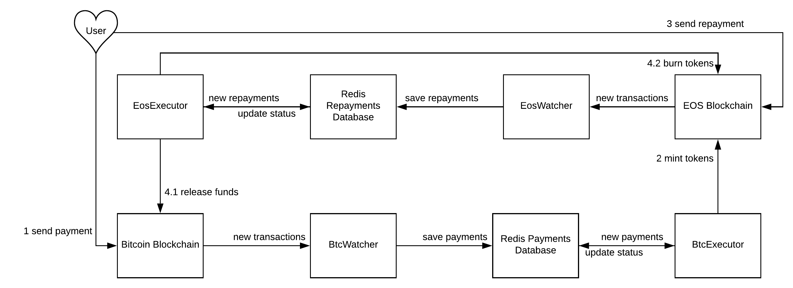

### btcp-node
Service allows to create EOS tokens that wrap other cryptocurrencies

### Architecture


### Instruction
```
alias cleos='docker exec -it pegtoken_nodeosd_1 /opt/eosio/bin/cleos -u https://api.kylin-testnet.eospacex.com --wallet-url http://keosd:8900 '
```

1) Deploy smart contract and create a token
```
cleos system buyram sevenflash44 sevenflash22 "25.0000 EOS"
cleos set contract sevenflash22 /eosdev/pegtoken
cleos push action sevenflash22 create '["sevenflash44", "BTC", 8]' -p sevenflash22
cleos push action sevenflash22 issue '["0","9.00000000 BTC",""]' -p sevenflash44
cleos push action sevenflash22 transfer '["sevenflash11","sevenflash22","0.00000090 BTC",""]' -p sevenflash11
```

2) Launch service
```
git clone https://github.com/7flash/btcp-node.git
npm install -g pm2
npm install
npm run test
vim src/config/secrets.js
pm2 start
```

3) Try it out
    1. Connect your EOS account with your BTC wallet
        ```
        cleos push action sevenflash22 signup '["sevenflash11","14xdPidvcTWhNEF4uNpYtdQFALALNdDVWD","1.00000000 BTC"]' -p sevenflash11
        ```
    2. Send 0.1 BTC to mqtaf5jVoHDQ8zhhJ7bvQimBJh5Ty5J75Q in testnet
    3. (Wait to receive 0.1 BTC-Token to your EOS account)
    4. Send 0.1 token back to sevenflash22
    5. (Wait to receive 0.1 BTC to your account 14xdPidvcTWhNEF4uNpYtdQFALALNdDVWD)
